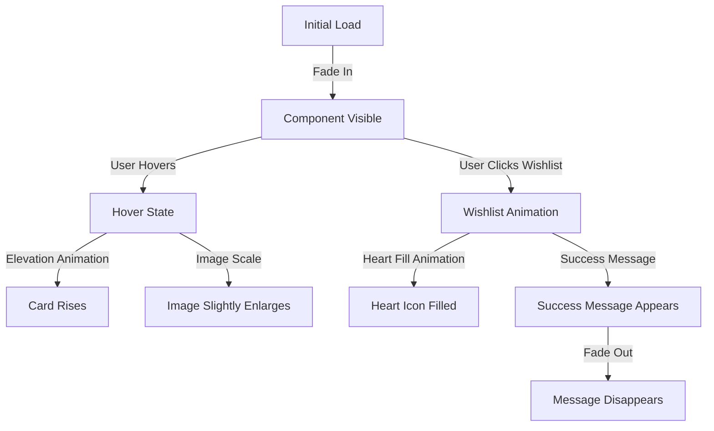

# Design Document: UI/UX Enhancement

## Overview

This design document outlines the approach for enhancing the UI/UX of the Monisha Uniforms e-commerce application. The focus is on modernizing the visual appearance and user experience without changing the core functionality or creating new components. The enhancements will target typography, animations, visual effects, and overall aesthetic appeal to create a more engaging, elegant, and modern shopping experience.

## Architecture

The UI enhancements will be implemented within the existing React application architecture. We'll leverage the current component structure while enhancing the visual presentation through:

1. **CSS Enhancements**: Using Tailwind CSS with extended configurations
2. **Animation Libraries**: Introducing Framer Motion for React-based animations
3. **Typography Improvements**: Implementing Google Fonts and improved typography scales
4. **Micro-interactions**: Adding subtle animations and transitions

The architecture will maintain the existing component hierarchy and routing structure while enhancing the visual layer.

## Components and Interfaces

### Enhanced Components

#### 1. ProductCard Component

The ProductCard component will receive significant visual enhancements:

```jsx
// Enhanced ProductCard.jsx
import { motion } from 'framer-motion';
import { useState } from 'react';
import { Link } from 'react-router-dom';
import firebaseService from '../src/services/firebase';

export default function ProductCard({ product }) {
  const [wishlistAdded, setWishlistAdded] = useState(false);
  
  // Existing functionality remains the same
  // Visual enhancements added
  
  return (
    <motion.div 
      className="bg-white rounded-lg overflow-hidden shadow-sm hover:shadow-xl transition-all duration-300"
      whileHover={{ y: -5 }}
      initial={{ opacity: 0 }}
      animate={{ opacity: 1 }}
      transition={{ duration: 0.3 }}
    >
      {/* Enhanced content */}
    </motion.div>
  );
}
```

#### 2. Global Component Styling

All components will receive consistent styling enhancements through:

- **Button Styling**: Enhanced with hover effects, transitions, and micro-interactions
- **Card Styling**: Improved shadows, borders, and hover states
- **Form Elements**: Refined input styles, focus states, and feedback animations
- **Navigation Elements**: Smoother transitions and hover effects

### New Utility Components

We'll introduce small utility components to enhance the UI:

#### 1. AnimatedImage Component

```jsx
// AnimatedImage.jsx
import { motion } from 'framer-motion';

export default function AnimatedImage({ src, alt, className }) {
  return (
    <motion.div
      className="overflow-hidden"
      whileHover={{ scale: 1.05 }}
      transition={{ duration: 0.3 }}
    >
      
    </motion.div>
  );
}
```

#### 2. FadeInSection Component

```jsx
// FadeInSection.jsx
import { motion } from 'framer-motion';

export default function FadeInSection({ children, delay = 0 }) {
  return (
    <motion.div
      initial={{ opacity: 0, y: 20 }}
      whileInView={{ opacity: 1, y: 0 }}
      viewport={{ once: true }}
      transition={{ duration: 0.5, delay }}
    >
      {children}
    </motion.div>
  );
}
```

## Data Models

No changes to the existing data models are required for this UI enhancement. The existing product data structure will be used with the enhanced visual components.

## Typography System

We'll implement a more refined typography system using Google Fonts:

```js
// Typography configuration in tailwind.config.js
fontFamily: {
  sans: ['Poppins', 'system-ui', 'sans-serif'],
  display: ['Playfair Display', 'serif'],
  mono: ['JetBrains Mono', 'monospace'],
},
```

Typography scale will be enhanced with more precise sizing and line heights:

```js
// Typography scale in tailwind.config.js
fontSize: {
  'xs': ['0.75rem', { lineHeight: '1rem' }],
  'sm': ['0.875rem', { lineHeight: '1.25rem' }],
  'base': ['1rem', { lineHeight: '1.5rem' }],
  'lg': ['1.125rem', { lineHeight: '1.75rem' }],
  'xl': ['1.25rem', { lineHeight: '1.75rem' }],
  '2xl': ['1.5rem', { lineHeight: '2rem' }],
  '3xl': ['1.875rem', { lineHeight: '2.25rem' }],
  '4xl': ['2.25rem', { lineHeight: '2.5rem' }],
  '5xl': ['3rem', { lineHeight: '1' }],
  '6xl': ['3.75rem', { lineHeight: '1' }],
}
```

## Animation System

We'll implement a consistent animation system using Framer Motion:

### Animation Variants

```js
// Common animation variants
export const fadeIn = {
  hidden: { opacity: 0 },
  visible: { opacity: 1 }
};

export const slideUp = {
  hidden: { y: 20, opacity: 0 },
  visible: { y: 0, opacity: 1 }
};

export const staggerChildren = {
  visible: {
    transition: {
      staggerChildren: 0.1
    }
  }
};
```

### Page Transitions

```jsx
// Page transition wrapper
const pageVariants = {
  initial: { opacity: 0 },
  in: { opacity: 1 },
  out: { opacity: 0 }
};

const pageTransition = {
  type: "tween",
  ease: "anticipate",
  duration: 0.5
};

// Usage in page components
<motion.div
  initial="initial"
  animate="in"
  exit="out"
  variants={pageVariants}
  transition={pageTransition}
>
  {/* Page content */}
</motion.div>
```

## Color System

We'll enhance the existing color system while maintaining the brand identity:

```js
// Enhanced color system in tailwind.config.js
colors: {
  primary: {
    50: '#fef2f2',
    100: '#fee2e2',
    200: '#fecaca',
    300: '#fca5a5',
    400: '#f87171',
    500: '#ef4444',
    600: '#dc2626',
    700: '#b91c1c',
    800: '#991b1b',
    900: '#7f1d1d',
    950: '#450a0a',
  },
  secondary: {
    50: '#f0f9ff',
    100: '#e0f2fe',
    200: '#bae6fd',
    300: '#7dd3fc',
    400: '#38bdf8',
    500: '#0ea5e9',
    600: '#0284c7',
    700: '#0369a1',
    800: '#075985',
    900: '#0c4a6e',
    950: '#082f49',
  },
  neutral: {
    50: '#fafafa',
    100: '#f5f5f5',
    200: '#e5e5e5',
    300: '#d4d4d4',
    400: '#a3a3a3',
    500: '#737373',
    600: '#525252',
    700: '#404040',
    800: '#262626',
    900: '#171717',
    950: '#0a0a0a',
  },
  // Additional accent colors can be added
}
```

## Shadow System

We'll implement a more refined shadow system for depth and elevation:

```js
// Enhanced shadow system in tailwind.config.js
boxShadow: {
  'sm': '0 1px 2px 0 rgba(0, 0, 0, 0.05)',
  'DEFAULT': '0 1px 3px 0 rgba(0, 0, 0, 0.1), 0 1px 2px 0 rgba(0, 0, 0, 0.06)',
  'md': '0 4px 6px -1px rgba(0, 0, 0, 0.1), 0 2px 4px -1px rgba(0, 0, 0, 0.06)',
  'lg': '0 10px 15px -3px rgba(0, 0, 0, 0.1), 0 4px 6px -2px rgba(0, 0, 0, 0.05)',
  'xl': '0 20px 25px -5px rgba(0, 0, 0, 0.1), 0 10px 10px -5px rgba(0, 0, 0, 0.04)',
  '2xl': '0 25px 50px -12px rgba(0, 0, 0, 0.25)',
  'inner': 'inset 0 2px 4px 0 rgba(0, 0, 0, 0.06)',
  'card': '0 0 0 1px rgba(0, 0, 0, 0.05), 0 2px 8px 0 rgba(0, 0, 0, 0.1)',
  'card-hover': '0 0 0 1px rgba(0, 0, 0, 0.05), 0 5px 15px 0 rgba(0, 0, 0, 0.15)',
  'none': 'none',
}
```

## Error Handling

For animation and UI-related errors:

1. **Fallback Rendering**: Implement error boundaries around animated components
2. **Progressive Enhancement**: Ensure core functionality works without animations
3. **Reduced Motion**: Honor user preferences for reduced motion

```jsx
// Example error boundary for animated components
class AnimationErrorBoundary extends React.Component {
  state = { hasError: false };
  
  static getDerivedStateFromError(error) {
    return { hasError: true };
  }
  
  render() {
    if (this.state.hasError) {
      // Render fallback UI without animations
      return this.props.fallback || <div>{this.props.children}</div>;
    }
    
    return this.props.children;
  }
}
```

## Testing Strategy

### Visual Regression Testing

We'll implement visual regression testing to ensure UI enhancements don't break existing layouts:

1. **Screenshot Comparison**: Capture before/after screenshots of key components
2. **Component Testing**: Test individual enhanced components in isolation
3. **Responsive Testing**: Verify enhancements across different viewport sizes

### Animation Testing

1. **Performance Testing**: Measure frame rates and performance impact
2. **Accessibility Testing**: Ensure animations respect reduced motion preferences
3. **Cross-browser Testing**: Verify animations work consistently across browsers

### User Testing

1. **A/B Testing**: Compare user engagement metrics between current and enhanced UI
2. **Usability Testing**: Gather feedback on the enhanced UI from real users

## Design Decisions and Rationale

### 1. Choice of Animation Library

**Decision**: Use Framer Motion for animations instead of CSS animations or other libraries.

**Rationale**:
- Framer Motion integrates seamlessly with React's component model
- Provides declarative animations that are easy to maintain
- Supports gesture animations and complex transitions
- Has built-in support for accessibility features like reduced motion

### 2. Typography System

**Decision**: Use Poppins as the primary font and Playfair Display for headings.

**Rationale**:
- Poppins offers excellent readability with a modern, clean aesthetic
- Playfair Display adds elegance and sophistication for headings
- Both fonts are available on Google Fonts with good browser support
- The combination creates visual hierarchy while maintaining readability

### 3. Enhanced ProductCard Design

**Decision**: Implement subtle hover animations and improved information hierarchy.

**Rationale**:
- Hover animations provide immediate feedback and enhance interactivity
- Improved information hierarchy makes product details more scannable
- Enhanced visual styling creates a more premium feel without changing functionality
- Consistent card design creates a cohesive shopping experience

### 4. Micro-interactions

**Decision**: Add subtle micro-interactions for user actions like adding to cart/wishlist.

**Rationale**:
- Micro-interactions provide immediate feedback for user actions
- Enhances perceived performance and responsiveness
- Creates a more polished and refined user experience
- Improves user confidence in completed actions

## Implementation Considerations

1. **Performance**: Ensure animations are optimized and don't cause layout thrashing
2. **Accessibility**: Respect user preferences for reduced motion
3. **Progressive Enhancement**: Core functionality should work without animations
4. **Browser Support**: Ensure visual enhancements work across modern browsers
5. **Mobile Experience**: Optimize animations and transitions for mobile devices

## Visual Design Examples

### ProductCard Component

```
┌─────────────────────────────┐
│                             │
│         Product Image       │
│                             │
│                             │
├─────────────────────────────┤
│ Product Name       $99.99   │
│                             │
│ Brief description text here │
│                             │
│ ┌─────┐  ┌─────┐            │
│ │ Tag1 │  │ Tag2│            │
│ └─────┘  └─────┘            │
│                             │
│ Available Sizes: S, M, L    │
│                             │
│ ┌─────────────┐    ┌───┐    │
│ │ View Details │    │ ♥ │    │
│ └─────────────┘    └───┘    │
│                             │
└─────────────────────────────┘
```

### Animation Flow



## Conclusion

This design document outlines a comprehensive approach to enhancing the UI/UX of the Monisha Uniforms e-commerce application. By focusing on typography, animations, visual effects, and overall aesthetic appeal, we aim to create a more engaging, elegant, and modern shopping experience without changing the core functionality or creating new components.